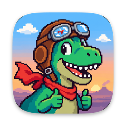
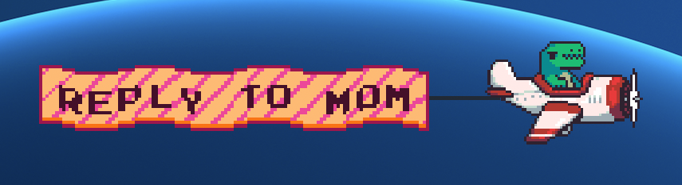

<p align="center">
  
</p>

<h1 align="center">Jurassic Air</h1>

<p align="center">
  A whimsical macOS desktop companion: a retro pixel-art airplane piloted by a dinosaur mascot flies across the screen pulling a wavy banner with your reminder. Hover to stop it, click the banner to open the linked URL.
</p>



## Download

<p>
  <a href="https://github.com/Amanfromearth/jurassic-air/releases/latest/download/JurassicAir.dmg"><b>⬇ Download JurassicAir.dmg</b></a>
  &nbsp;·&nbsp; macOS 13 or later, Apple Silicon
</p>

1. Open the DMG and drag **JurassicAir** into **Applications**.
2. Open the app. macOS blocks it the first time, because the app is not notarized.
3. Go to **System Settings → Privacy & Security** and click **Open Anyway**.

Or remove the quarantine flag in Terminal:

```bash
xattr -dr com.apple.quarantine /Applications/JurassicAir.app
```

After launch, look for the dino plane icon in the menu bar.

Local-personal-use app — no sandbox, no analytics, no cloud. Runs as a menu-bar agent (no Dock icon).

## Build & run

All commands run from the project root.

### Build the .app (use this normally)

```bash
./build.sh              # builds release, packages JurassicAir.app
./build.sh --open       # ...and opens it right away
./build.sh --dmg        # ...and packages JurassicAir.dmg (drag-to-install)
open ./JurassicAir.app  # just launch the already-built app
```

`JurassicAir.app` is required for **Launch at login** to work — `SMAppService` needs a real bundle.

### Quick dev loop (faster iteration, no .app)

```bash
swift run JurassicAir              # debug build + run from terminal
swift run -c release JurassicAir
```

Launch-at-login is disabled in this mode (the toggle in Settings will be greyed out) — use it for fast iterate-and-test only.

### Stop a running instance

```bash
pkill -f "JurassicAir.app/Contents/MacOS/JurassicAir"   # the packaged app
pkill -f ".build/.*JurassicAir"                        # a swift-run process
```

Or click ✈ in the menu bar → **Quit Jurassic Air**.

### Check what's running

```bash
pgrep -fl JurassicAir
```

### Compile-only

```bash
swift build             # debug
swift build -c release  # release
```

### Clean

```bash
swift package clean
rm -rf .build JurassicAir.app
```

## In-app

Click ✈ in the menu bar for the action menu, or use:

- `⌘⇧1` spawn placeholder plane
- `⌘⇧2` trigger a random mock reminder
- `⌘⇧3` reload sprite/font assets from disk
- `⌘⇧4` open Settings

### Settings panel (⌘⇧4)

- **Custom Reminders** — add/edit/delete user reminders with date+time picker and repeat rule (Once / Every N min / Hourly / Daily / Weekly). Persisted to `UserDefaults` and fired by a 15 s scheduler tick.
- **Size** — single slider scales plane + banner uniformly (0.2×–1.5×)
- **Speed** — flight speed in px/s, tunes live
- **Audio** — toggle `plane.mp3` flight loop
- **Startup** — Launch at login (requires running as JurassicAir.app)
- **Banner Wave** — amplitude / frequency / phase sliders for the procedural pixel banner

## Project layout

```
Sources/JurassicAir/
├── JurassicAirApp.swift        SwiftUI @main + NSApplicationDelegateAdaptor
├── AppDelegate.swift           wires managers, status item, settings window
├── Overlay/                    transparent NSWindow per screen, mouse passthrough
├── Scene/                      SpriteKit: PlaneScene, PlaneNode, BannerRibbon, AudioPlayer
├── Reminders/                  models, mock catalog, custom store, scheduler, dispatcher
├── Hotkeys/                    Carbon RegisterEventHotKey for ⌘⇧1..4
├── UI/                         settings panel, custom reminders list/form, status item
└── Resources/                  plane.png, plane.mp3, logo / logo@2x, PressStart2P.ttf

Assets/
└── AppIcon.png                 1024×1024 app icon master; build.sh turns it into AppIcon.icns
```
